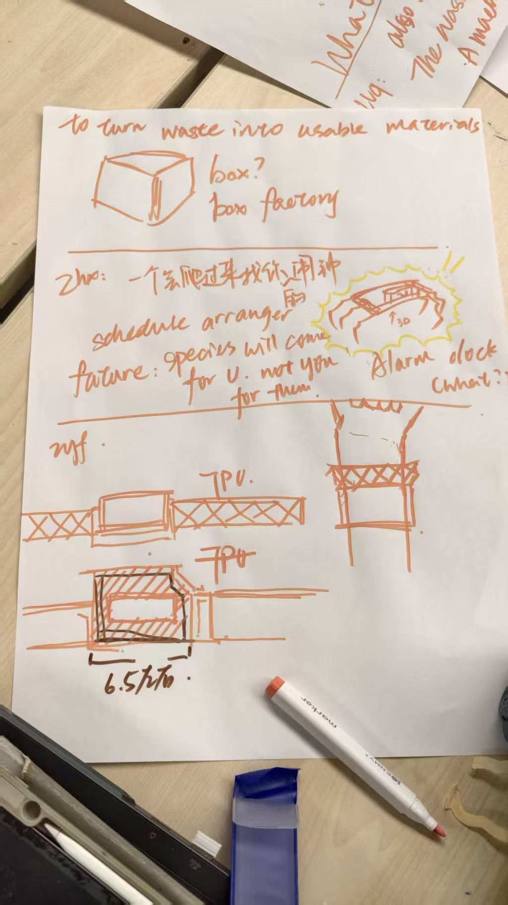
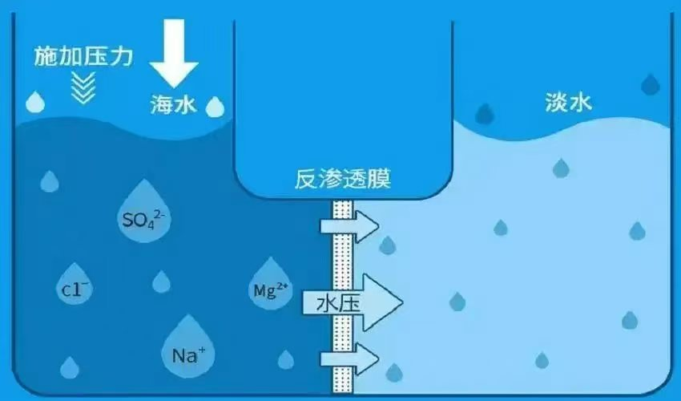
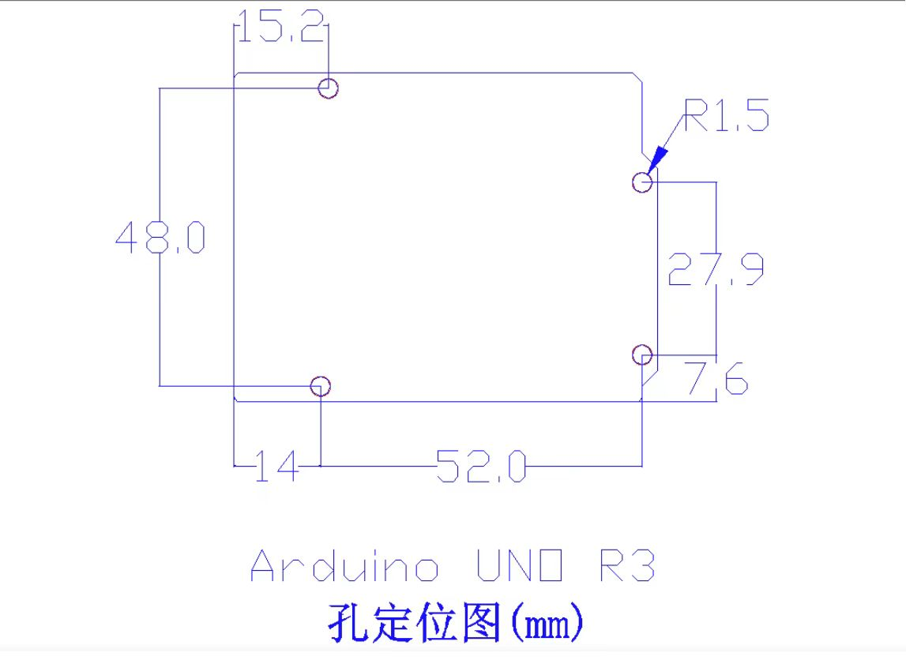
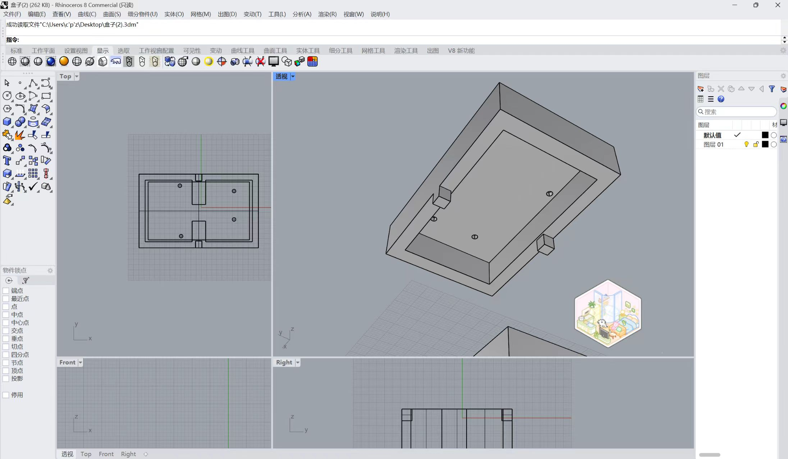
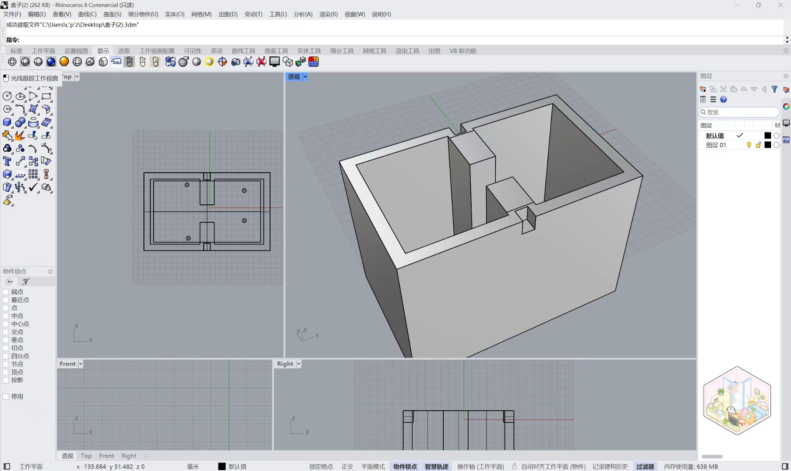

# HATM-小蔡同学在HATM的历险

# 个人作业
一个基于未来的arduino装置外壳，不允许使用胶水，只能用螺丝和机械紧固。

## 第一步 构建一个未来

  确定一个未来，并且基于这个未来，去构想人们会需要一个什么样的产品。
  
  比如我构想的未来是一个海平面大幅上升，有大量人口需要长时间生活在海面的漂浮城市上，湖泊和河流大量减少，淡水资源紧缺，因此人们都需要一个便携的海水淡化器，有事没事都可以进行海水淡化，用于生活所需。

  如今的海水淡化技术中，利用半透膜进行淡化的反渗透法是最高效最有性价比的方法。给一侧的水施加压力，半透膜会只让水分子通过，大量无机盐会被留在施压的一侧。
  基于它的工作原理，我想到了这个外壳需要两个舱室，而arduino模块则可以置于盖子上，用于驱动施压或者监测水质。

## 第二步 建模
建立模型除了考虑适应装置功能的形状之外，还要为固定arduino模块作出考量。因此需要测量arduino模块的大小以及孔径以及孔与孔之间的距离。

同时还要考虑如何使得盖子可以稳稳地停留在盒子上不会乱跑，于是我做了一个榫卯结构来固定它。

## 第三步 3D打印
在我的小红书中详细介绍了模型处理以及ultimaker的工作流程。像这样一个box比较完美的一点就是它不需要额外的支撑，打印出来就是一体的无需拆卸。

## 补充的激光切割部分
